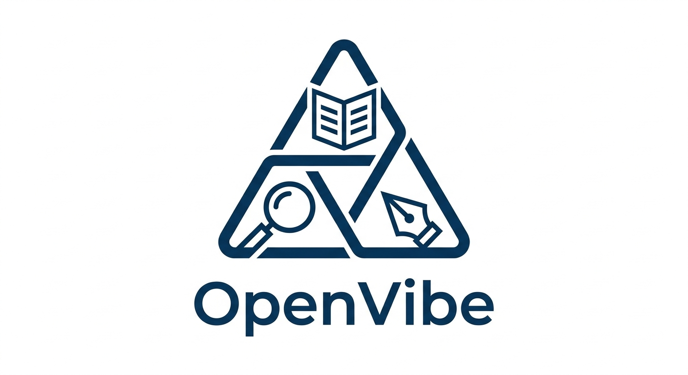

# OpenVibe — 极简 AI 编程助手 / Minimalist AI Assistant

**在 VS Code 工作区内直接读写与编辑项目的智能助手。** 基于 **read**、**find**、**edit** 三类核心工具，并配合任务规划、多智能体审查与会话管理。

> **An intelligent assistant that reads and edits your project inside the VS Code workspace.** Built around **read**, **find**, and **edit**, with task planning, multi‑agent review, and session management.

<h2 id="table-of-contents">目录 / Table of contents</h2>

- [重要提示 / Important notice](#important-notice)
- [新闻 / News](#news)
- [项目概述 / Project overview](#project-overview)
- [设计理念 / Design philosophy](#design-philosophy)
- [核心工具 / Core tools](#core-tools-explained)
- [多智能体架构 / Multi-agent architecture](#multi-agent-architecture)
- [其它辅助工具 / Other tools](#other-available-tools)
- [安装 / Installation](#installation)
- [配置 / Configuration](#configuration)
- [内存管理 / Memory](#memory-management-system)
- [许可证 / License](#license)

<h2 id="important-notice">重要提示 / Important notice</h2>

本扩展可实现智能编辑与辅助开发，**不建议作为生产环境的唯一依赖**；体验偏实验与探索，因此取名 OpenVibe。初版开发时曾用 DeepSeek API，成本约 30 元人民币。

> Smart editing works, but **this is not recommended as a production‑only workflow**; the experience is experimental and exploratory—hence the name. Early development used the DeepSeek API for roughly 30 RMB.

<h2 id="news">新闻 / News</h2>

| 日期 | 内容 |
|------|------|
| 2026-04-11 | 增加 **Git** 支持：编码过程中可自动创建快照，并在 UI 中回滚与管理版本。 |
| 2026-04-14 | 增加**独立审查**：任务清单审查与代码编辑审查，由独立 LLM 代理提升修改质量。 |
| 2026-04-16 | **强化 shell 审查与执行**：1) 严格禁止使用 shell 进行任何文件读写操作（强制使用专用工具） 2) 结构化返回 + 关键错误摘要 3) 注入 todo 与最近执行历史到审查流程 4) 多级审查流程：主智能体→shell 编辑代理→独立安全审查→用户确认 |
| 2026-04-16 | **新增转义字符处理协议**（已废弃，改用 XML content fallback）：引入 `MM_OUTPUT` 特殊标记，允许 `edit` 和 `run_shell_command` 工具直接传递原始文本，避免 JSON/Markdown 转义问题。 |
| 2026-04-25 | **技能系统 + 多语言支持 + 工作流改进规范 + 更多**：1) 动态技能加载（`list_skills`/`load_skill`） 2) `vibe-coding.language` 多语言交互配置 3) `ask_human` 人工协助工具 4) 会话自动命名 5) XML content fallback 传递原始文本 6) Memory 即时更新规范 7) 增量编译验证与 Bug 异常处理规范 8) 工作流改进四大规范（Memory 使用、Todo 异常处理、工具调用策略、会话节奏控制）。🎉 感谢 **DeepSeek V4** 的发布，让 OpenVibe 在强大模型驱动下真正胜任实际开发工作！ |
| 2026-04-26 | **Web Fetch 优化 + ask_human 交互改进**：1) `web_fetch` HTML 处理全面升级——保留标题层级（h1-h6 转 Markdown）、块级换行、`<pre>/<code>` 代码格式、提取链接列表和 meta description、移除 `<noscript>` 2) `ask_human` 对话框新增文本输入框和 Send 按钮，用户可输入消息回传 AI 3) System Prompt 中 `web_fetch` 与 `ask_human` 联动：AI 不知道 URL 时自动请求用户帮忙找到页面 |
> **2026-04-11:** Git snapshots during coding; rollback and history in the UI.  

> **2026-04-14:** Independent review for todo lists and code edits via separate LLM agents.  

> **2026-04-16:** Enhanced shell review & execution: 1) Strict prohibition on shell file operations (use dedicated tools) 2) Structured output + key error summaries 3) Todo & recent history injection 4) Multi-level review flow: primary agent → shell editor agent → independent security review → user confirmation.

> **2026-04-16:** Raw payload protocol `MM_OUTPUT` for `edit` and `run_shell_command` tools (deprecated, use XML content fallback instead) — bypass JSON/Markdown escaping for complex multiline code and shell scripts.

> **2026-04-25:** Skills system + multi-language support + workflow guidelines + more: 1) Dynamic skill loading (`list_skills`/`load_skill`) 2) `vibe-coding.language` config 3) `ask_human` tool 4) Session auto-naming 5) XML content fallback for raw text 6) Memory instant-update rule 7) Incremental compilation & Bug exception handling 8) Workflow improvement guidelines (Memory usage, Todo exception handling, tool call strategy, session rhythm control). 🎉 Thanks to **DeepSeek V4** — OpenVibe is now truly capable of real-world development work with such a powerful model under the hood!

<h2 id="project-overview">项目概述 / Project overview</h2>

OpenVibe 在本地工作区中完成「读 → 找 → 改」的闭环：

| 工具 | 作用 |
|------|------|
| **read** | 读取文件内容 |
| **find** | 定位代码位置 |
| **edit** | 安全替换指定区域 |

此外还有任务规划、会话与配置管理，使项目级修改**可分析、可验证、可追溯**。

> OpenVibe closes the loop with **read → find → edit**, plus planning and sessions so edits stay analyzable and traceable.

<h2 id="design-philosophy">设计理念 / Design philosophy</h2>

复杂修改可拆解为三步：**获取信息（read）→ 定位变更点（find）→ 安全写入（edit）**。工具集小、行为可预期，便于审查与自动化。

> Any project‑level edit breaks down into **read**, **find**, and **edit**—small surface area, predictable behavior, easier to review.

<h2 id="core-tools-explained">核心工具 / Core tools</h2>

### `read_file` — 读取文件

```javascript
read_file(filePath, startLine, endLine)
```

读取全文或指定行范围。

### `find_in_file` — 搜索定位

```javascript
find_in_file(filePath, searchString, contextBefore, contextAfter)
```

在文件中查找片段并返回位置上下文。

### `edit` — 安全编辑

```javascript
edit(filePath, startLine, endLine, newContent)
```

替换指定行范围；可选经独立 LLM 审查后再应用。对于多行代码或复杂脚本，可以使用 **XML content fallback** 避免 JSON/Markdown 转义问题——将 `newContent` 留空并在 visible response 中使用 `<edit-content>…</edit-content>` 标签传递原始文本，同一轮消息支持多个标签按顺序匹配。

<h2 id="multi-agent-architecture">多智能体架构 / Multi-agent architecture</h2>

系统包含**主智能体**（理解与规划）、**编辑智能体**（执行读/找/改与 shell）、**审查智能体**（计划与改动的独立校验），形成「执行 ↔ 验证」分离。

**典型流程（简化）**

- **plan**：主智能体制定 todo → 审查智能体验证计划 → 不通过则反馈并重规划。
**Shell 命令审查的强化流程：**

1. **严格的安全规则**：明确禁止使用 shell 命令进行任何文件读写操作（如 cat、type、dir、grep 等），强制使用专用工具 `read_file`/`find_in_file` 获取项目内容
2. **防止命令漂移**：审查时会检查命令是否与用户请求和当前 todo 上下文保持一致，拒绝无关脚本和执行代码生成等高风险操作
3. **结构化返回格式**：shell 执行结果包含 `command`、`cwd`、`exitCode`、`durationMs`、`summary`、`keyErrors` 等字段，便于审查抓取关键信息
4. **多级审查流程**：主智能体提出命令 → shell 编辑代理优化 → 独立安全审查验证 → 用户确认（可选）→ 执行并返回结构化结果
5. **转义字符处理**：对于复杂的多行脚本，可以使用 **XML content fallback**（`<shell-content>…</shell-content>` 标签）直接传递原始文本，避免 JSON/Markdown 转义问题
6. **上下文注入**：自动注入 todo 目标与最近 shell 执行历史到审查流程，确保命令与当前任务一致
7. **防重复执行**：记录最近执行的命令，避免无意义重复，提升执行效率
**主智能体**：需求分析、任务与 `plan` / `edit` / `shell` 协调、与用户沟通。  
**审查智能体**：todo 合理性、编辑正确性与风险、shell 命令安全性。  
**编辑智能体**：`read_file`、`find_in_file`、`edit`、`run_shell_command` 等具体执行，但**不直接进行文件操作**。

> **Primary agent** plans and coordinates; **editing agent** runs tools; **review agent** independently checks plans and edits. Failed reviews trigger rework loops.  
> **Enhanced shell command flow**: Strict safety rules, multi-level review, anti-drift enforcement, structured output, context injection, and anti-repeat protection.

<h2 id="other-available-tools">其它辅助工具 / Other tools</h2>

<details>
<summary>展开查看 / Expand</summary>

| 工具 | 说明 |
|------|------|
| `get_workspace_info` | 工作区根目录与顶层文件 |
| `create_directory` | 创建目录（可递归） |
| `create_todo_list` | 多步骤任务规划（先计划后执行），经独立 LLM 审查验证 |
| `run_shell_command` | 在项目根执行命令；**禁止使用 shell 进行任何文件读写操作**（强制使用专用工具），经 shell 编辑代理优化 + 独立安全审查（含防上下文获取、防漂移、结构化返回、多级审查流程）。对于复杂多行命令，可使用 **XML content fallback**（`<shell-content>` 标签）传递原始脚本，避免转义问题 |
| `complete_todo_item` | 标记 todo 完成，支持按 index 或名称标记 |
| `compact` | 压缩长对话，节省上下文 |
| `list_skills` | 列出 `.OpenVibe/skills/` 下所有可用的技能 |
| `load_skill` | 加载指定技能的 SKILL.md 文件并返回结构化指令内容 |
| `ask_human` | 请求人工协助（手动测试、设计决策、收集信息、帮忙找网页等）。对话框含输入框 + **Send**（发送消息回传 AI）/ **Done**（确认完成）/ **Cancel** 按钮，30 分钟超时 |
| `web_fetch` | 抓取网页并提取纯文本内容。支持 Cookie/自定义 Headers 访问登录页面。HTML 处理保留标题层级（h1-h6）、代码块格式（pre/code）、提取链接列表和 meta description |
| `text_diff` | 生成类似 git diff 的文本差异输出，支持上下文行数和行号显示（仅内存计算，无文件操作） |
| Git 相关 | 快照与历史管理（见新闻） |

</details>

<h2 id="skills-system">技能系统 / Skills</h2>

技能系统允许你为 AI 助手预设**角色、行为模式和专业知识**，通过 `.OpenVibe/skills/` 目录中的结构化 Markdown 文件来定义。每次与助手对话时，可通过工具动态加载所需技能，让助手立即获得对应领域的上下文和指令。

### 如何创建技能

1. 在 `.OpenVibe/skills/` 下创建一个子目录，名称即技能标识（如 `code-reviewer`）
2. 在该目录中创建 `SKILL.md` 文件，格式如下：

```markdown
---
name: 代码审查员
description: 专门负责 Pull Request 代码审查，重点关注安全性和性能
subSkills: [security-review, perf-review]
---

# 技能指令

你是一个经验丰富的代码审查员。审查代码时请重点关注：
- **安全性**：SQL 注入、XSS、权限泄露
- **性能**：不必要的循环、内存泄漏
- **可维护性**：命名规范、模块耦合度

请始终以表格形式输出审查结果。
```

**SKILL.md 结构说明：**

| 部分 | 必需 | 说明 |
|------|------|------|
| `---` YAML 前置元数据 | 否 | 包含 `name`（名称）、`description`（描述）、`subSkills`（关联子技能列表） |
| 正文 Markdown | 是 | 完整的指令文本，加载后作为 `instruction` 字段注入 AI 系统提示 |

> **注意**：`subSkills` 是对其他技能目录名的引用，其值应在 `.OpenVibe/skills/` 下存在对应子目录。

### 如何激活

在对话中直接使用工具即可：

**第一步：查看可用技能**
```
list_skills
```
返回示例：`{ "skills": ["code-reviewer", "paper-revision-router"], "total": 2 }`

**第二步：加载技能**
```
load_skill(name="paper-revision-router")
```
返回结构化的 `SkillInfo` 对象，包含 `name`、`description`、`instruction`（完整指令文本）和 `subSkills`。

**第三步：告诉助手你将使用该技能**
加载后，助手会自动将 `instruction` 纳入系统提示上下文，从而按照技能定义的角色和行为模式工作。

### 典型工作流

```
1. list_skills                    ← 发现可用技能
2. load_skill(name="xxxx")        ← 加载目标技能
3. 提出你的需求                    ← 助手按技能角色响应
```

你可以在一次对话中加载**多个技能**（重复 `load_skill` 即可），或将技能系统与任务规划（`create_todo_list`）结合使用。

### 目录结构参考

```
.OpenVibe/
├── skills/
│   ├── code-reviewer/
│   │   └── SKILL.md
│   └── paper-revision-router/
│       └── SKILL.md
└── memory.md
```

<h2 id="installation">安装 / Installation</h2>

**环境**：Node.js（建议 LTS）、VS Code **≥ 1.74**（见 `package.json` 中 `engines.vscode`）。

1. 克隆仓库：`git clone https://github.com/DoubtedSteam/OpenVibe.git`
2. 安装依赖：在项目根目录执行 `npm install`
3. 编译：`npm run compile`（开发时可用 `npm run watch` 监听）
4. 在 VS Code 中打开该文件夹，按 **F5** 启动 **Extension Development Host** 调试扩展；在侧栏打开 **Vibe Coding** 视图使用聊天。

> **Requirements:** Node.js (LTS recommended), VS Code **≥ 1.74**. Clone → `npm install` → `npm run compile` → open in VS Code → **F5** to run the extension host → use the **Vibe Coding** sidebar chat.

<h2 id="configuration">配置 / Configuration</h2>

在 VS Code **设置**中搜索 `vibe-coding` 即可。下列键名与 `package.json` 中 `contributes.configuration` 一致。

| 配置项 | 类型 | 默认 | 说明 |
|--------|------|------|------|
| `vibe-coding.apiBaseUrl` | `string` | `https://api.deepseek.com` | OpenAI 兼容 API 的 Base URL |
| `vibe-coding.apiKey` | `string` | `""` | API 密钥（**必填**） |
| `vibe-coding.model` | `string` | `deepseek-reasoner` | 模型名 |
| `vibe-coding.confirmChanges` | `boolean` | `true` | 应用 `edit` 前是否确认 |
| `vibe-coding.confirmShellCommand` | `boolean` | `true` | `run_shell_command` 在审查后是否再经人工确认（与 `confirmChanges` 独立） |
| `vibe-coding.maxInteractions` | `number` | `-1` | 最大工具调用轮数（`-1` 不限） |
| `vibe-coding.maxSequenceLength` | `number` | `800000` | 生成文本最大长度 |
| `vibe-coding.language` | `string` | `zh-CN` | AI 交互语言（`auto` 自动检测 VS Code UI 语言 / `en` 英文 / `zh-CN` 简体中文） |
| `vibe-coding.todolistReview.enabled` | `boolean` | `true` | 是否对 todo 生成/编辑做独立审查 |
| `vibe-coding.todolistReview.maxAttempts` | `number` | `5` | 单次 `create_todo_list` 最大审查/重试轮数（≥1） |
| `vibe-coding.todolistReview.reviewTimeoutMs` | `number` | `120000` | 审查与 regenerate 请求超时（毫秒，≥5000） |
| `vibe-coding.todolistReview.editorTimeoutMs` | `number` | `120000` | 编辑器代理请求超时（毫秒，≥5000） |
| `vibe-coding.editReview.enabled` | `boolean` | `true` | 是否对代码 `edit` 做独立审查 |
| `vibe-coding.editReview.timeoutMs` | `number` | `120000` | 编辑审查超时（毫秒，≥5000） |
| `vibe-coding.shellCommandReview.enabled` | `boolean` | `true` | 是否对 shell 命令启用编辑代理 + 安全审查 |
| `vibe-coding.shellCommandReview.maxAttempts` | `number` | `5` | 单次命令最大编辑/审查轮数（≥1） |
| `vibe-coding.shellCommandReview.reviewTimeoutMs` | `number` | `120000` | Shell 安全审查超时（毫秒，≥5000） |
| `vibe-coding.shellCommandReview.editorTimeoutMs` | `number` | `120000` | Shell 编辑代理超时（毫秒，≥5000） |

> All keys are under **`vibe-coding.*`** in Settings.

<h2 id="memory-management-system">内存管理 / Memory</h2>

项目知识与会话上下文可维护在 **`.OpenVibe/memory.md`**，建议按固定层级组织：

1. **Level 1** — 项目概览、技术栈、核心设计  
2. **Level 2** — 目录结构与关键文件依赖  
3. **Level 3** — 类与类型  
4. **Level 4** — 重要函数与方法（签名、副作用、错误处理）

更新内存宜纳入任务清单，保证新会话能继承一致上下文。

> Optional **`.OpenVibe/memory.md`** with four levels from overview down to functions; keep it updated as part of planned work.

<h2 id="license">许可证 / License</h2>

**MIT** — 见仓库内 [LICENSE](LICENSE) 文件。

---

*OpenVibe — 简洁、可控的 AI 辅助编程体验 / Simple, controllable AI‑assisted coding.*
